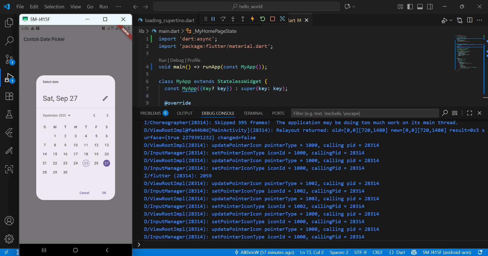

## Jobsheet 4 Aplikasi Pertama dan Widget Dasar Flutter

**Nama  : Aldo Khrisna Wijaya**

**NIM   : 2341760091**

**Kelas : SIB - 3C**

## Hasil Percobaan

1. Praktikum 3 Langkah 11: Menjalankan program pertama kali menggunakan USB Debugging ke perangkat mobile.

2. Praktikum 4 Langkah 1: Menerapkan text widget.

3. Praktikum 4 Langkah 2: Menerapkan image widget.

4. Praktikum 5 Langkah 1: Menerapkan Cupertino Button dan Loading Bar.

5. Praktikum 5 Langkah 2: Menerapkan Floating Action Button (FAB).

6. Praktikum 5 Langkah 3: Menerapkan Scaffold Widget.

7. Praktikum 5 Langkah 4: Menerapkan Dialog Widget.

8. Praktikum 5 Langkah 5: Menerapkan Input dan Selection Widget.

9. Praktikum 5 Langkah 6: Date and Time Pickers.
    - Sebelum: 

    - Sesudah

